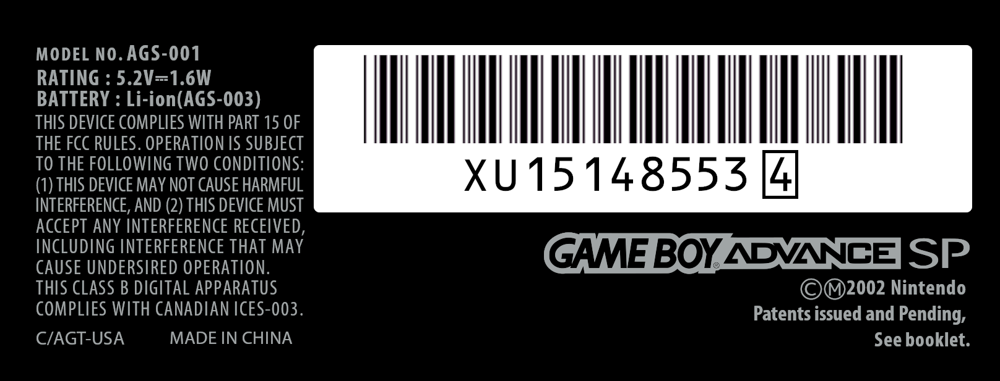
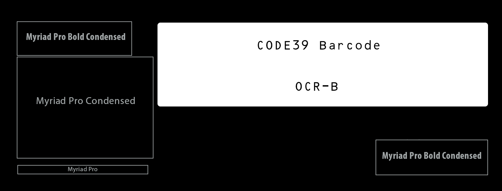
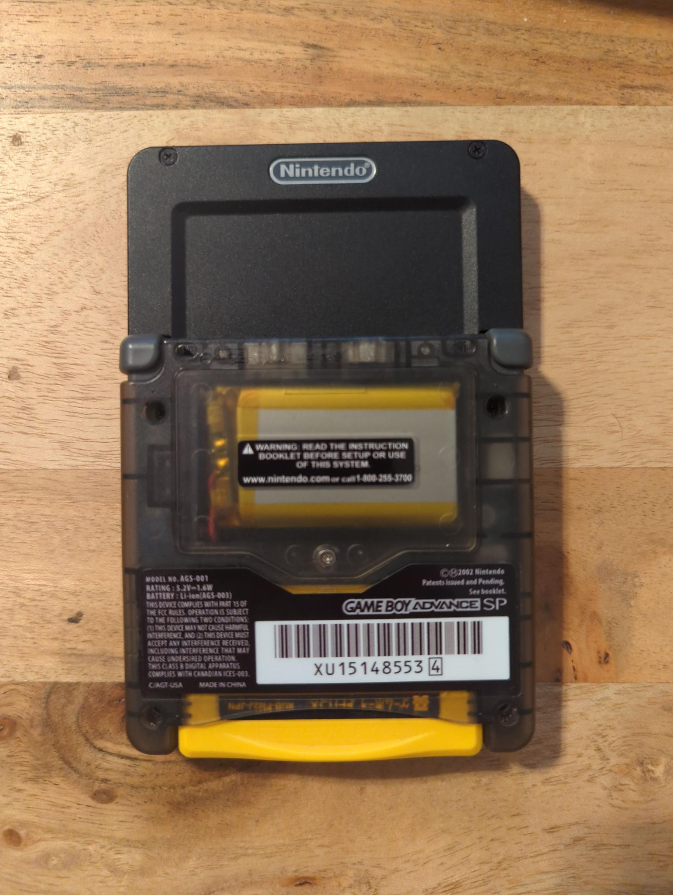

I recently created a custom back label for the Game Boy Advance SP to complete the look of my modified handheld. I'm sharing it here for anyone interested in downloading it or recreating the label themselves.

<!-- endexcerpt -->

## Recreated Back Label

This is the final AGS-001 design:

> You can download all the variations of this label and other resources [here](/download/AGS_Labels.zip).

## Why Recreate this Label?

Given all the cheap aftermarket labels out there, you might wonder why I’d go through the trouble of recreating one from scratch. The short answer: I didn’t just want an exact replica; I wanted a label that looked stock at first glance but had subtle alterations.

The longer answer is that I previously bought a Makho "Slate" kit, a modification for the Game Boy Advance SP that transforms its clamshell design into a flat form, reminiscent of the original Game Boy. This kit uses stock parts, including the back housing, which has a recessed area for the label. However, with the flat design, the label appears upside down, as the clamshell's orientation no longer applies. While most labels can be rotated, the serial number label can't, due to its specific shape.

After an extensive search for a customizable back label that fit the aesthetic of the North American stock label (the one with the big barcode) and coming up empty, I decided to design my own upside-down version.

## Creating the Label

### Research

I found a few labels online, but most didn’t resemble the stock look I wanted. Some were clearly modified with logos and non-original designs, and one site was even selling a set of templates that looked far from authentic.

The closest match I found was from [reddit user /u/dagomez97](https://www.reddit.com/r/Gameboy/comments/j001fg/gameboy_advance_sp_back_sticker_editable/), who had attempted a reproduction of the original label. Although I didn’t use their label directly, I referenced the image they used while designing my label.

Additionally, [RetroSix's "GBA SP Back Shell (Sticker Template)"](https://www.retrosix.wiki/gba-sp-back-shell-sticker-template) provided a clear cut guide that helped define the label’s boundaries, making positioning easier.

### Barcode Generation

For the barcode font, which seemed to be widely known within the community, I used "OCR-B," as suggested by many on Reddit (see [this comment by /u/glitchdweller](https://www.reddit.com/r/Gameboy/comments/n0idv0/making_a_reproduction_sn_label_for_my_gba_sp_ags/)).

The barcode itself appears to be of the "Code39" type, where the encoded information matches the text underneath the barcode. Using [tec-it.com's barcode generator](https://barcode.tec-it.com/en/Code39?data=XU151485534), I stretched the generated barcode image with linear scaling to keep the lines sharp. For added authenticity, I used the original serial number from my donor device in the barcode.

### Font Matching

Matching the fonts proved the most challenging aspect. Initially, I thought Fira was close, but as I progressed, it became clear it wasn’t an exact match. I experimented with other similar fonts, focusing on characters that looked incorrect in earlier tests. Eventually, I settled on "Myriad Pro." While it may not be identical, it’s close enough that most people wouldn’t notice the difference without a reference.

Here’s a rough image map of the fonts used in my label:

### Design Considerations

I chose to retain the original misspelling of "undersired" for authenticity (this error appears on both AGS-001 and AGS-101 models).

## Final Design

Once I had a label that looked authentic, it was just a matter of rearranging the elements for the upside-down orientation and having it printed. I used [Mathewmods on Etsy](https://www.etsy.com/shop/Matthewmods), where I’d ordered labels previously. They offer the type of custom printing I needed, and the final result turned out well. In the future, I might try to find someone who prints on a silver backed label to match the stock look more closely, but for now, it’s exactly what I envisioned.

Here are the custom Slate labels compared to the OEM label:

And here’s the finished handheld with the custom label:

---

I’m sharing this for anyone who, like me, was searching for an authentic-looking label and found only limited options online. This should serve as a free resource for the community to use or modify as needed.
